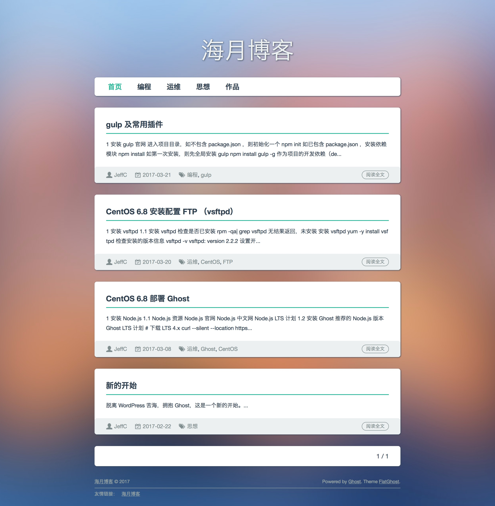

# FlatGhost
一个伪扁平化风格 ghost 博客中文主题，主题预览：[blog.imzhengfei.com](http://blog.imzhengfei.com)

**桌面端预览**




# 安装

前往 [release](https://github.com/imzhengfei/ghost-theme-flatghost/releases) 页面下载最新版 zip 安装包

登录 ghsot 博客管理后台或者打开 ghost 桌面 app 进入管理后台

`SETTINGS` > `General` > `Themes` > `UPLOAD A THEME`

上传下载的最新版主题 zip 安装包并 `ACTIVE` 启用主题


# 使用 & 二次开发

### 1. 常规功能

*   更换主题背景图片：`SETTINGS` > `General` > `Blog Cover` > `UPLOAD IMAGE`
*   个人信息显示支持：支持 `Your Profile` 界面所有个人信息显示（ Email 除外）
*   添加导航菜单：`SETTINGS` > `Navigation` ，按需添加即可 

### 2. 添加备案号

打开 `default.hbs` 文件，找到

```html
<div class="fr">
	<span>Powered by</span>
     <a href="https://ghost.org" rel="nofollow" target="_blank">Ghost</a><span>.</span>
     <span>Theme</span>
     <a href="https://github.com/imzhengfei/FlatGhost" rel="nofollow" title="从 GitHub 获取本博客主题" target="_blank">FlatGhost</a><span>.</span>
</div>
```

在 `</div>` 前增加，如

```html
<div class="fr">
	<span>Powered by</span>
     <a href="https://ghost.org" rel="nofollow" target="_blank">Ghost</a><span>.</span>
     <span>Theme</span>
     <a href="https://github.com/imzhengfei/FlatGhost" rel="nofollow" title="从 GitHub 获取本博客主题" target="_blank">FlatGhost</a><span>.</span>
	<span>鄂1000000-1号</span>
</div>
```

### 3. 添加友情链接

打开 `default.hbs` 文件，找到

```html
<ul id="links" class="clearfix">
    <li>友情链接：</li>
    <li><a href="http://blog.imzhengfei.com" target="_blank" rel="nofollow">海月博客</a></li>
</ul>
```

自行添加即可，如添加 GitHub 首页为友情链接

```html
<ul id="links" class="clearfix">
    <li>友情链接：</li>
    <li><a href="http://blog.imzhengfei.com" target="_blank" rel="nofollow">海月博客</a></li>
    <li><a href="https:/github.com" target="_blank" rel="nofollow">GitHub</a></li>
</ul>
```

### 4. 在个人信息页卡片添加更多信息

打开 `partials/main-author.hbs` 文件，找到

```html
<ul class="links clearfix">
    {{#if website}}
    <li><a href="{{website}}" target="_blank">个人主页</a></li>
    {{/if}}
    {{#if facebook}}
    <li><a href="{{facebook_url}}" target="_blank" rel="nofollow">Facebook</a> </li>
    {{/if}}
    {{#if twitter}}
    <li><a href="{{twitter_url}}" target="_blank" rel="nofollow">Twitter</a> </li>
    {{/if}}
</ul>
```

按照自己需要自行排序添加，如添加微博链接

```html
<ul class="links clearfix">
    {{#if website}}
    <li><a href="{{website}}" target="_blank">个人主页</a></li>
    {{/if}}
    {{#if facebook}}
    <li><a href="{{facebook_url}}" target="_blank" rel="nofollow">Facebook</a></li>
    {{/if}}
    {{#if twitter}}
    <li><a href="{{twitter_url}}" target="_blank" rel="nofollow">Twitter</a></li>
    {{/if}}
    <li><a href="http://weibo.com/imzhengfei" target="_blank" rel="nofollow">微博</a></li>
</ul>
```

### 5. 其他按需自行修改

### 6. 构建（可选）

本项目使用 `gulp` 构建到 `/build` 目录，再生成 zip 安装包

进入项目目录，安装 gulp 及插件

```shell
npm install
```

构建项目到 `/build` 目录

```shell
gulp
```

在项目目录下生成主题 zip 安装包

```shell
gulp zip
```

**如不需构建，可删除掉 `build` 目录文件，直接修改完当前目录文件手动打包成 zip 文件，在博客管理后台上传并启用即可**


# 功能计划

-   [ ] 代码高亮显示
-   [ ] 移动浏览器适配
-   [ ] 主题变色


# LICENSE

MIT