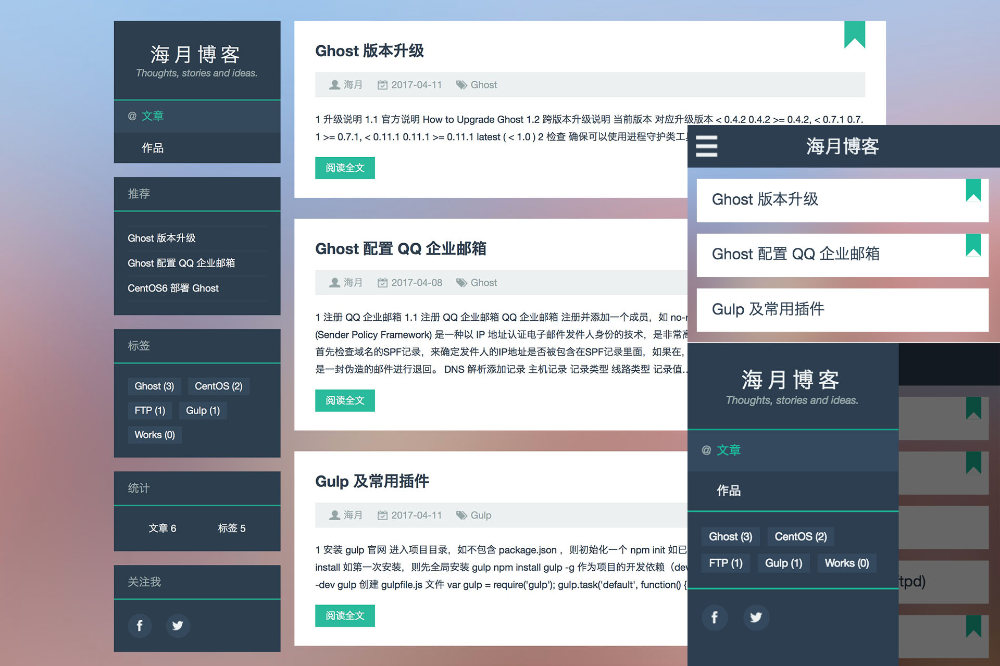

# FlatGhost
一个响应式设计的扁平化 ghost 博客主题，主题预览：[blog.imzhengfei.com](http://blog.imzhengfei.com)

# 安装

前往 [release](https://github.com/imzhengfei/ghost-theme-flatghost/releases) 页面下载最新版 zip 安装包

登录 ghsot 博客管理后台或者打开 ghost 桌面 app 进入管理后台

`SETTINGS` > `General` > `Themes` > `UPLOAD A THEME`

上传下载的最新版主题 zip 安装包并 `ACTIVE` 启用主题

`Labs` > `Enable Beta Features` ，勾选 `Public API ...`

# 特色

**良好的主题设置支持**

*   支持背景图片 `cover` 更换
*   支持博客 `logo` 更换（左侧栏顶部，默认显示文字链接）
*   支持文章列表和文章内容显示特色图片
*   博客社会化链接显示（左侧边栏底部）
*   作者社会化链接显示（作者页面）等

**拓展功能**

*   智能 SEO Meta 标签，自动给所有页面添加 “title”、“keywords”、“description”
*   统计信息小工具（文章数，表签数）
*   标签云小工具
*   推荐文章小工具（被 “featured” 的文章）
*   博客社会化链接图标拓展支持：github、知乎、豆瓣、微博、QQ 空间（需手动在主题文件中添加链接）
*   作者信息页面可以玩去自定义添加社会化链接

**响应式设计**

*   适配所有尺寸屏幕
*   移动设备采用安卓风格侧滑菜单

# 功能计划

-   [x] 响应式设计
-   [ ] 多个模板页支持：友情链接、留言板、专题推荐等
-   [ ] 主题变色
-   [ ] 代码高亮显示
-   [ ] 文章大纲小工具

# LICENSE

MIT